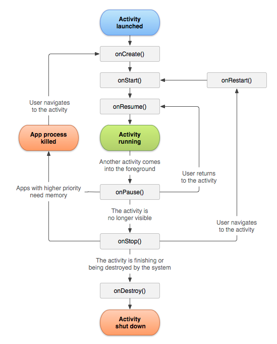
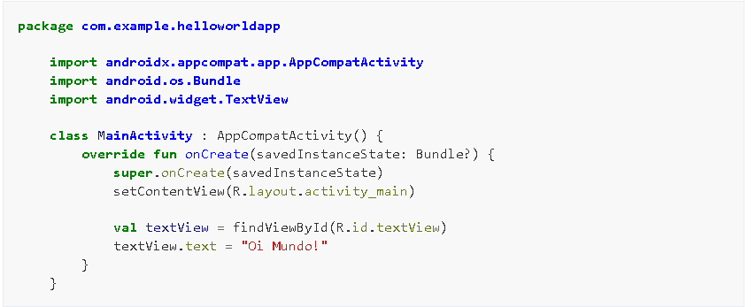
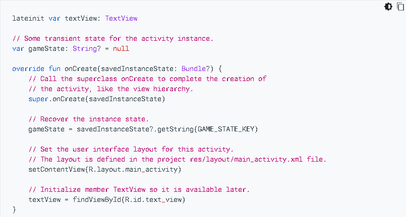
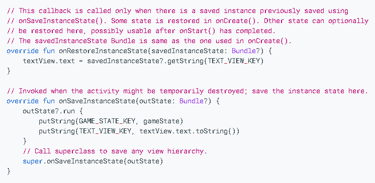
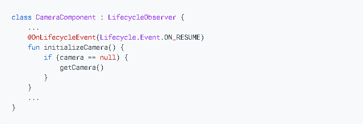
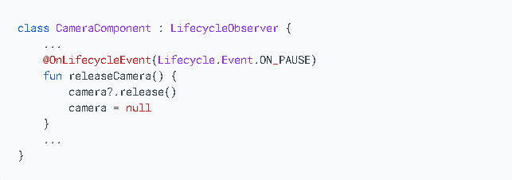
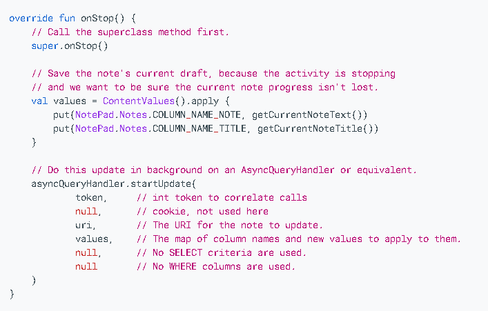

# Atividade-N3
Atividade N3 - Ciclo da Vida da Activity
Aluno: Thiago Henrique Souza e Silva
4º Período - Noite - Faculdade Nova Roma

Um breve resumo do que se trata o ciclo da vida de uma Activity, que trás a medida que o usuário navega no aplicativo, sai dele e retorna a ele, as instâncias do Activity no aplicativo transitam entre diferentes estaods no ciclo da vida, ou seja, a classe Activity fornece vários callbacks(o que é um callback -> é um conceito fundamental na programação que descreve a capacidade de uma função chamar a outra função como argumento), em termos simples, é uma função que é passada como paramêtro para outra função e é executada quando um determinado evento ocorre, ou seja, ele permite que atividade saiba quando um estado muda ou que o sistema está criando, interrompendo ou retomando uma atividade ou destruindo o processo em que ela está localizada.

Dentro dos métodos de callbacks do ciclo da vida, podemos declarar como atividade de se comportar quando o usuário sai e retorna dela. Um exemplo disso é se estiver sendo criado um play de streaming de vídeo, poderar pausar o vídeo e encerrar as conexões de rede quando o usuário alternar para outro app. Quando o usuário retornar, poderá se reconectar à rede e permitir que ele retome o vídeo do mesmo local. Nesse sentido, os callbacks são utilizados na programação em páginas da web, em manipulação de arquivos, requisições assícronas e também nas animações e transições.

Nestes contexto, uma boa implementação dos callbacks do ciclo da vida pode ajudar se app a evitar os seguintes pontos:

1. Falhas se o usuário receber uma chamada telefônica ou mudar para outro aplicativo enquanto estiver usando seu aparelho;
2. Consumo de recursos importantes do sistema quando o usuário não estiver usando ativamente o aplicativo; e
3. Falhas ou perda do progresso do usuário quando a orientação da tela mudar entre paisagem e retrato.

Em relação ao exposto acima, para navegar por transições entre os estágios do ciclo da vida da atividade, a class Activity fornece um conjunto principal de 7 callbacks: 

1. onCreat();
2. onStart();
3. onResume();
4. onPause();
5. onStop();e
6. onDestroy();
7. onRestart()

O sistema invoca cada um desses callbacks à medida que atividade entra em um novo estado.
O layout abaixo demonstra a representação visual desse paradigma.

# Ciclo de Vida da Activity

Cada tópico desse layout será explicado abaixo.

Activity launched -> indica que uma Activity está sendo iniciada ou relançada no Android, seja ela pela primeiria vez ou após ter sido minimizada ou pausada. É um evento central no ciclo da vida de uma Activity, pois marca o ponto em que a interação do usuário com a interface começa ou é retomada.

1. onCreat() -> esse callback precisa ser implementado. Ele é acionado assim que o sistema cria a atividade. Quando a atividade é criada, ela insere o estado Criado. No método onCreat(), execute a lógica básica de inicialização do aplicativo que acontece apenas uma vez durante toda a vida útil da atividade. Exemplo de uma onCreat(), sua implementação pode vincular dados a lista, associar a ativadade a um ViewModel(é um componente arquitetural do Android Jetpack, introduzido para resolver problemas comuns relacionados à gestão de dados e à preservação de estados em aplicativos Android. O principal objetivo do ViewModel é manter e gerenciar dados relacionados à interface do usuário de forma consciente do ciclo de vida, garantindo que os dados sobrevivam a mudanças de configuração, como rotações de tela, sem vazamentos de memória) e instanciar algumas variáveis com escopo de classe. Esse método recebe parâmetro savedInstanceState, que é um objeto Bundle que contém o estado salvo anteriormente da atividade. Se a atividade nunca existiu, o valor do objeto Bundle será nulo.

Na imagem a seguir iremos demonstrar uma configuração fundamental para atividade como declarar a interface do usuário(definida em um arquivo de layout XML), para definir as variáveis de membro e configurar parte da interface. Nesse contexto, o exmplo abaixo mostra o arquivo de layout XML transmite o ID de recurso R.layout.main_activity do arquivo setContentView()

Depois do método onCreat() terminar a execução, a atividade entra em estado de Started e o sistema chama os métodos onStart() e onResume() em rápida sucessão.

2. onStart() -> Quando a atividade entra no estado "Iniciado", o sistema invoca onStart(). Essa chamada torna a atividade visível para o usuário enquanto o app se prepara para que a atividade entre em primeiro plano e se torne interativa. Exemplo disso é o método que o código que mantém a IU é inicializado.

Quando a atividade é movida para o estado "Iniciado", qualquer componente ciente do ciclo de vida vinculado ao ciclo de vida da atividade recebe o evento ON_START. 

Nesse caso o método onStart() é concluído rapidamente e, assim como no estado "Criado", a atividade não permanece no estado "Iniciado". Quando nesse callback é concluído, a atividade insere o estado Retomado e o sistema invoca o método onResume()

3. onResume() -> Quando a atividade entra no estado "Retomado", ela vem para o primeiro plano e o sistema invoca o callback onResume(). É nesse estado que o aplicativo interage com o usuário. o App permanece nesse estado até que algo aconteça para tirar o foco do app, exemplo disso, é o dispositivo receber uma ligação, o usuário navegar para outra atividade ou desligar a tela do dispositivo.

Quando a atividade é movida para o estado "Retomado", qualquer componente ciente do ciclo de vida vinculado ao ciclo de vida da atividade recebe o evento ON_RESUME. É nesse momento que os componentes do ciclo de vida podem ativar qualquer funcionalidade que precise operar enquanto o componente estiver visível e em primeiro plano, como o início da visualização da câmera.

Quando ocorre um evento de interrupção, a atividade entra no estado Pausado e os sistema invoca o callback onPause(). 

Se a atividade retornar do estado "Pausado" para o estado "Retomado", o sistema chamará novamente o método onResume(). Por esse motivo, implemente onResume() para inicializar os componentes liberados durante onPause() e para executar outras inicializações que precisam ocorrer sempre que a tividade entra no estado "Retomado".

Segue um exemplo de onResume();

Nesse sentido, quando a atividade receber o evento ON_RESUME, a câmara é inicializada para garantir que esteja pronta quando a atividade estiver visível. No entanto, em cenários de modo de várias janelas, a atividade pode ser pausada mesmo quando vísivel em segundo plano o que pode afetar o acesso à câmera por outros aplicativos. Para manter a câmara ativa enquanto a atividade está pausada, é recomendado inicializá-la após o evento ON_START. Contudo isso pode limitar o acesso de outro aplicativo à câmera no mod de várias janelas, prejudicando a experiência do usuário. 

Portanto, é crucial escolher o momento adequado no ciclo de vida para controlar recursos compartilhados, especialmente em cenários de modo de várias janelas. 

4. onPause() -> É a primeira função a ser invocada quando a Activity perde o foco (isso ocorre quando uma nova Activity é iniciada), ou seja, um evento que interrompe a execução, conforme descrito o callback onResume(), pausa a atividade atual. Um outro exmplo seria, no modo de várias janelas, apenas um app fica em foco por vez, e o sistema pausa todos os outros.

Quando uma atividade entra no estado "Pausado", os componentes vinculados ao ciclo recebem o evento ON_PAUSE, momento em que devem interromper funcionalidades não necessárias em segundo plano, como visualizações da câmera. O método onPause() é utilizado para pausar operações temporariamente e liberar recursos do sistema, como sensores, visando economia de bateria. Em cenários de múltiplas janelas, é recomendado usar onStop() para ajustar operações e recursos da interface, garantindo um suporte adequado ao modo de várias janelas.

Este exemplo coloca o código de lançamento da câmera após o evento ON_PAUSE ser recebido pelo LifecycleObserver. 

A execução de OnPause() é muito breve e nãop oferece necessariamente tempo suficiente para realizar opreações de salvamente. Por isso, não use onPause() para salvar dados do aplicativo ou do usuário, fazer chamadas de rede ou executar transações de bancco de dados. Esse trabalho pode não ser concluído antes da conclusão do método.

5. onStop() -> Só é chamada quando a Activity fica completamente encoberta por outra Activity, ou seja, quando a atividade não está mais visível para o usuário, ela entra no estado Interrompido e o sistema invoca o callback onStop(). Isso pode ocorrer quando uma atividade de recém-iniciada cobre toda a tela. O sistema também chama onStop() quando a atividade termina de ser executada e está preste a ser encerrada.

Deve usar o onStop para executar operações de desligamento relativamente intensas da CPU. Por exemplo, se você não puder encontrar um horário melhor para salvar informações em um banco de dados poderá fazer isso durante onStop(). A tela abaixo mostra a implementação de onStop() que salva o conteúdo de um a nota de rascunho armazenamento persistente.

Uma observação que devemos ter é o fato de quando uma atividade for interrompida, o sistema poderá destruir o processo que contém a atividade se precisar recuperar a memória. Mesmo que o sistema destrua o processo enquanto a atividade está interrompida, ele ainda mantém o estado dos objetos View como texto em um widgetEditText em um Bundle (um blob de pares de chave-valor) e os restaura caso o usuário navegue de volta à atividade. 

6. onDestroy() -> A última função a ser executada. Depois dela, a Activity é considerada "morta" - ou seja, não pode mais ser relançada. Se o usuário voltar a requisitar essa Activity, um novo objeto será construído. Alguns motivos são:
   6.1 A atividade está sendo concluíad porque o usuário descartou completamente a atividade ou poque finish() está sendo chamado na atividade.
   6.2 O sistema está destruindo temporariamente a atividade devido auma mudança na configuração, com a rotação do dispositivo ou a entrada no modo de várias janelas.

Quando a atividade é movida pra o estado destruído, qualquer componete ciente do ciclo de vida vinculado ao ciclo de vida da atividade recebe o evento ON_DESTROY. É nesse momentoque os componentes do ciclo de vida podem limpar tudo o que precisam antes que o Activity seja distruído. 

Um ponto de observação é que em vez de colocar lógica na Activity para determinar por que está sendo destruída, use um objeto ViewModel para conter os dados de visualização relevantes para a Activity. Se a Activity fornecida devido a uma mudança de configuração, a ViewModel não precisará fazernada, já que será preservada e fornecida à próxima instância do Activity.

7. onRestart() -> Chamada imediatamente antes da OnStart(), quando uma Activity volta a ter foco depois de estar em background.

Durante a execução do método onRestart(), a atividade não está visível para o usuário, mas não está disponível na memória. Esse método é frequentemente utilizado para realizar operações que devem ser reconfiguradas ou atualizadas antes que a atividade se torne visível novamente. Por exemplo, você pode reiniciar atualizações de dados ou reconfiguarar o layout da interface do usuário para refletir mudanças desde a ultima vez que a atividade estava visível.
